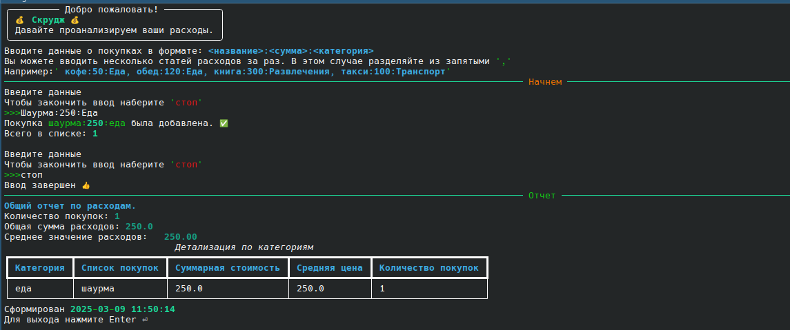

# Scrooge (Scrooge)


Программа для анализа расходов. Создана как проект к курсу Twitch-канала [Максима Вершинина](https://www.twitch.tv/wozborn).



## Установка

### 1. Клонирование репозитория

#### Откройте терминал (или командную строку) и выполните команду для клонирования репозитория:

```
git clone https://github.com/AtheistATT/scrooge.git
cd scrooge
```
### Создание виртуального окружения

#### Для Windows:
```python -m venv venv```

#### Для macOS/Linux:
```python3 -m venv venv```
### Активация виртуального окружения
#### Для Windows:
```venv\Scripts\activate```

#### Для macOS/Linux:
```source venv/bin/activate```
### Установка библиотеки
#### Для Windows:
```pip install rich```

#### Для macOS/Linux:
```pip3 install rich```
### Запуск
```python scrooge.py```

